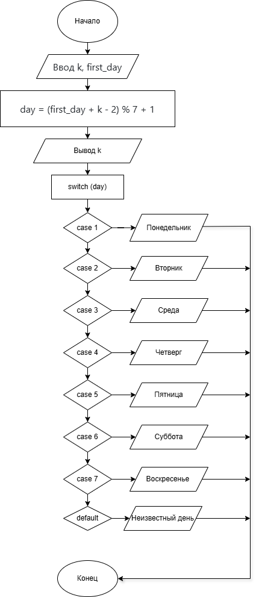

# Домашняя работа 7
## Условие задачи
Вариант 6. Дано целое число k, определить каким днем недели является k-й день невисокосного года, в котором 1 января приходиться на заданный заранее день недели.
### Алгоритм
1. **Начало**
2. Объявление переменных и задаем исходные числа:
   - int k, first_day
3. Ввод данных:
   - Ввод k - номер дня в году от 1 до 365             
   - Ввод first_day - день недели 1 января от 1 до 7
3. Bычисляем день недели для k-го дня:
   - day = (first_day + k - 2) % 7 + 1

4. Вывод результата с использованием switch.
   Оператор выбора (switch-case):
   - case 1: Вывод "понедельник"
   - case 2: Вывод "вторник"
   - case 3: Вывод "среда"
   - case 4: Вывод "четверг"
   - case 5: Вывод "пятница"
   - case 6: Вывод "суббота"
   - case 7: Вывод "воскресенье"
   - default: Вывод "неизвестный день"
  5. Вывести результаты расчетов с подстановкой всех результатов в текст.
6. **Конец**
### Блок-схема

(https://viewer.diagrams.net/?tags=%7B%7D&lightbox=1&highlight=0000ff&edit=_blank&layers=1&nav=1&title=7.png&dark=auto#R%3Cmxfile%3E%3Cdiagram%20name%3D%22%D0%A1%D1%82%D1%80%D0%B0%D0%BD%D0%B8%D1%86%D0%B0%20%E2%80%94%201%22%20id%3D%22WlLvJSTW966vfAFX3iQ5%22%3E7Vxbk5s2FP41nkkenAGEwH60d71NZ9I2052maV8yWixjstiigNd2f32FJK4SGzaxkc32BaOjC%2BKc73ySjoRH4GZz%2BClG0foXssThyDKWhxG4HVnWdALoNRMcuQDaEy7w42DJRWYpuA%2F%2BxUJoCOkuWOKkVjAlJEyDqC70yHaLvbQmQ3FM9vViKxLWnxohH0uCew%2BFsvTPYJmuuXRiuaX8PQ78df5k05nynA3KC4s3SdZoSfYVEViMwE1MSMrvNocbHGa6y%2FXC69215BYdi%2FE27VLBHv8dY8s340%2B%2FL8zH3z5%2BCD8lY5u38oTCnXhh0dn0mGsAL6lCRJLE6Zr4ZIvCRSmdx2S3XeLsMQZNlWU%2BEBJRoUmFX3GaHoV10S4lVLRON6HI5c%2FMHtT6bkKUkF3s4WdeKMcIin2cPlMOFBagyMVkg9P4SOvFOERp8FTvBxIY8otypZrpjdD0C7RuylqnqpveZte5MaI6mbj5Pb3O2XUhWyYMqRtkFtivgxTfR4ipZk8dUaXfJxyn%2BPC8hmWNiAoAChgf6%2F65L53CNIRsXXEI1ziTDi21DmdCV9mV6xMyfToXpb2p3VF9zrnU5wzN8UFHx4c6HR8otO6EtLvzJELbmvqdf3bZyDD3SEjiEZhlffQf3gDaNfpsA0D%2BaxtvmR7pyLZNxyu0CcIjLz1GURTicXJMUrzhhedhsH38BXn3THZHa3A5fRraZKgXz7zHPsFU%2FsfPzRx1%2BV8JNaxl3KNtoq7wHodPOA08xJOzOEAhv01onXGC42ClbnqWvQSV3zA1WMZiQ74G3XpVfYuWeqXmEgbRTG%2BmEx14BvX3dIzCwN%2FynISCiz%2FOeEDeo8%2FgP24YyILCMtUbbiOn6K7js9%2BMsBhtza0KbdEx2XjkVVdBnKRfluiYw4SijiNFtND0WTrJiLJb6kEoDHFI%2FBhtaMGIaphCGMfNvI9lxrd4cBUccD5DOxUvmrAxqih40VXwon0uXpwMjRdhR150dfIibOXFZfCkpMV235S87H%2BGvViGPQmNUnr8QlZf9hg%2FZn3MTGu8qTAn7facU6oxztp5y0S0VcMtMs1WguXiFbOksUJeHTsvgEBVWVm6ZtKXmbDFZM2nFCYpFGYILd9WhcBcWcCafIfntNm1raEW5VIx168kZt7fMtTVSfb8c3gGxOpY5chjlTXtcw5vKtZA1z1YuR0HK7PFVP2MVq566Wmxhea8bT537TO1%2BgrWUq1gJ33O1Mzhxa66Bq9MvdErOXyV7IPUW2fjLh1x30pm6CHAYtfhCVQLCatXeA4uwmJ2DbGYWmMsUBFdfSWKh4ZOxZtydMtDCeaz6%2BbkbU02D7ukn%2BCr0%2BAGx3oHJXZQjV3wbOQwuDCD2TXOYGoNNNjTV6t4vvGqjRzkEI8gB9kAOsnBBvLEoVdqyCcpA0Jo51XdVCs1KJZ1r0TxtqOVGmTFC2oAF0UNULGm6JcaBhfvMacdEdpmqp6oQbU%2F8ToUb9taqUGerglqsC%2BLGlzd1DC4aENx2u%2Bb1KA12mCrjnS8DsXblk7F5w3L1AAvihocRaC8V2oAw0No1yUv0IpQe3CByM6Kt7UGIq3WWIN8ClQnNbiKQ7T9UsPg5rXA6koNWue1YHBhyO6K1xqGzLspU4N7WdQw0U0Ng4uGAbsrQrVGw4B8rGGJV2gXphcF0AnsBtCz7a%2FDwR3%2F%2BGHciaofScAOKwrLOW7Dcs1PcrhDiFoNqxTd%2BAFAK0IT5ddOkF0n7OpWjk7xr3ZMdrXyr3mK41V0%2BDTE2aqyEV7gRkLBlZ20sjt4mgn6dDWg2K0uP11Y5Jai9zN2b9QtKBmIS%2FKTwtuHJBopzndem9nc5ggunzHo12x5ww2zzbhTAWYGs3JdVJzNGJw5TO3mkKeezIvumNrv6kzHOZF9tzhIczi2dnMo5g%2BZd7gV8rKkAYlTm7wveeXmgK52c6hnCYKsjMooYg%2FTI6Ch3QTtw3zhC4uKOQqaYgP%2FwMxhA93mgOrhOxsv5C%2FcG1PheWWmNWgzAaermeC5zKQY1qV16HY5y%2F6LhKa8ECVJ4NUVVV%2BFUlXEx88iiyX%2BynLewTx5e6iWvD2KVPEHI6zeIUg%2Fs2pTyxFp3owNoUiX7WSJYyVRMTKTjU63ys1h%2Fe19XTUQKoaGCjvnshMvmsG04eb8PaVFs9SQ3fznh0mjoZbVN8UL%2B3YxLxZlBZIXdFgsP9r61Sw%2FFenSFXgPThoKgF32G17mKwLmZg3izwP8hGBuC2b3A9Imttzml4ZdQSqFiIwGW545RAS7nF65Jly07X%2F2RF6Nb%2FVccCJcuKBnXHTZhLgqXGgd1OC0bk7nVHzhOD3josvnM1eFi5bdaD18Ab93stPEBZz2jIsu2%2BpXhYuWLSFNuLBOhQurX1zkPDccXGiddzpW3Zx28xTC9%2BLChqfCBU2W%2F6zJi5d%2FTwoW%2FwE%3D%3C%2Fdiagram%3E%3C%2Fmxfile%3E)

## 2. Реализация программы:

    #define _CRT_SECURE_NO_DEPRECATE
    #include <stdio.h>
    #include <stdlib.h>
    #include <locale.h>
    #define _USE_MATH_DEFINES
    #include <math.h>
    int main() {
        int k, first_day;
        setlocale(LC_ALL, "RUS");

        // Ввод данных
        printf("Введите номер дня в году (k): ");
        scanf("%d", &k);

        printf("Введите день недели 1 января (1-понедельник, 2-вторник, ..., 7-воскресенье): ");
        scanf("%d", &first_day);

        // Вычисление дня недели для k-го дня
        int day = (first_day + k - 2) % 7 + 1;

        // Вывод результата с использованием switch
        printf("%d-й день невисокосного года - это ", k);
    
        switch (day) {
        case 1: printf("понедельник\n"); break;
        case 2: printf("вторник\n"); break;
        case 3: printf("среда\n"); break;
        case 4: printf("четверг\n"); break;
        case 5: printf("пятница\n"); break;
        case 6: printf("суббота\n"); break;
        case 7: printf("воскресенье\n"); break;
        default: printf("неизвестный день\n"); break;
        }
    
        return 0;
    }
## 3. Результаты работы программы

Введите номер дня в году (k): 13

Введите день недели 1 января (1-понедельник, 2-вторник, ..., 7-воскресенье): 1

13-й день невисокосного года - это суббота

## 4. Информация о разработчике
Гусев Степан, бИЦ-251
